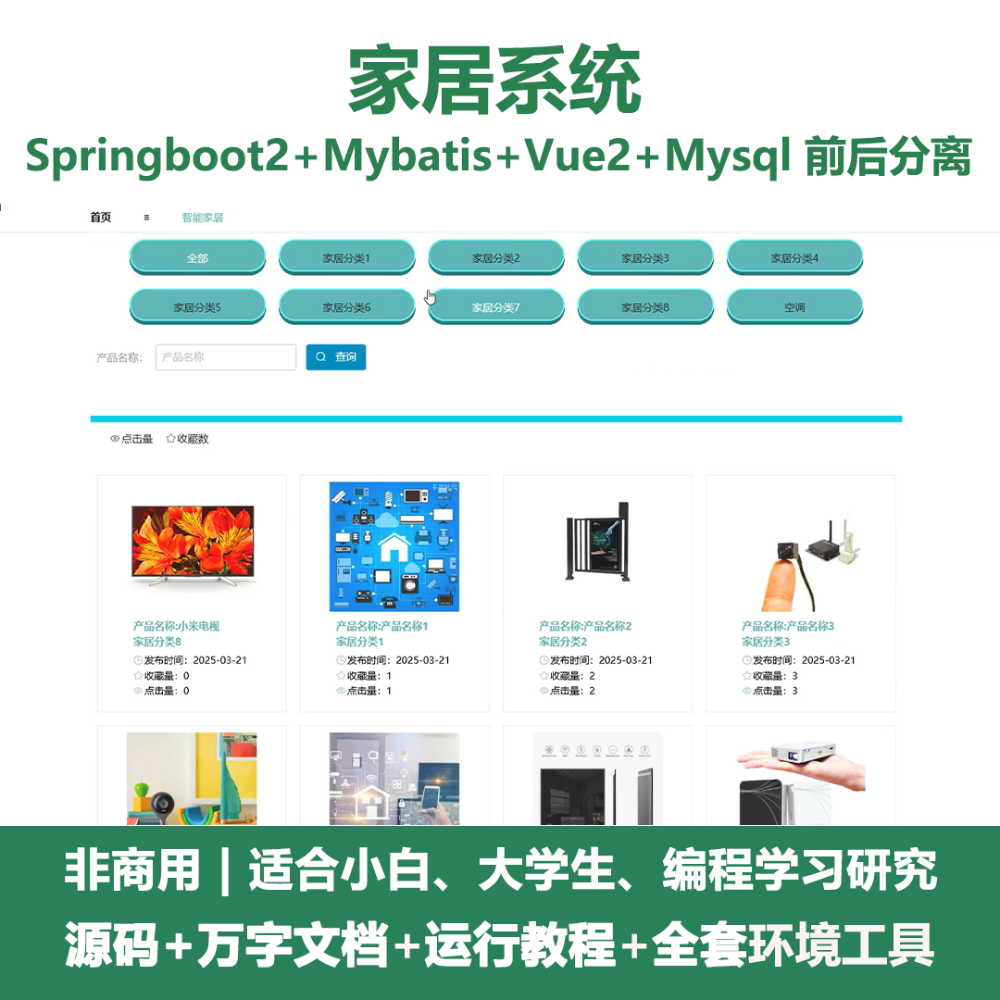
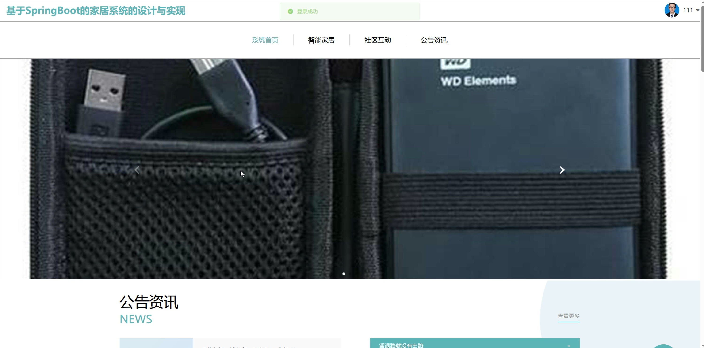
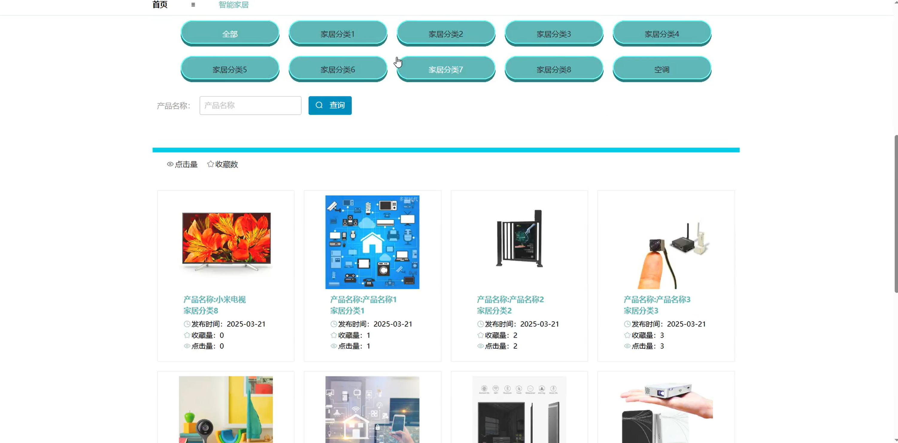
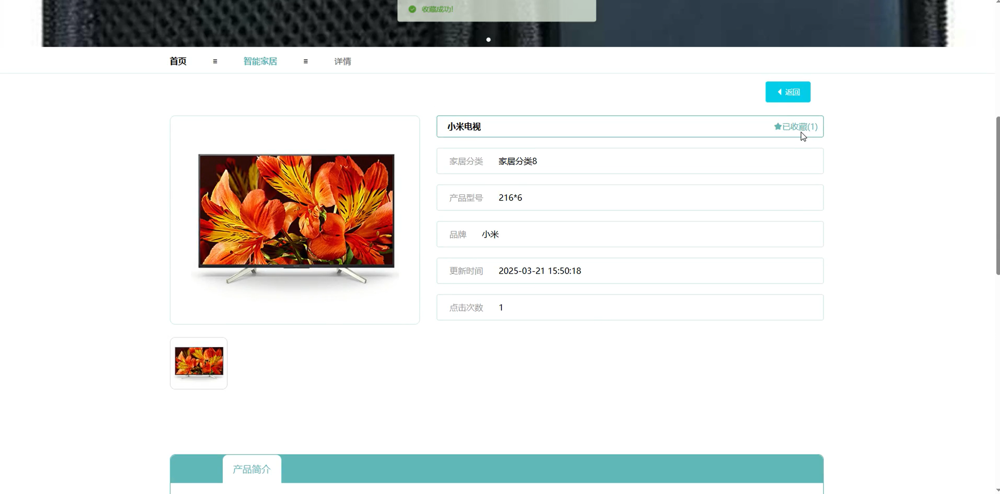
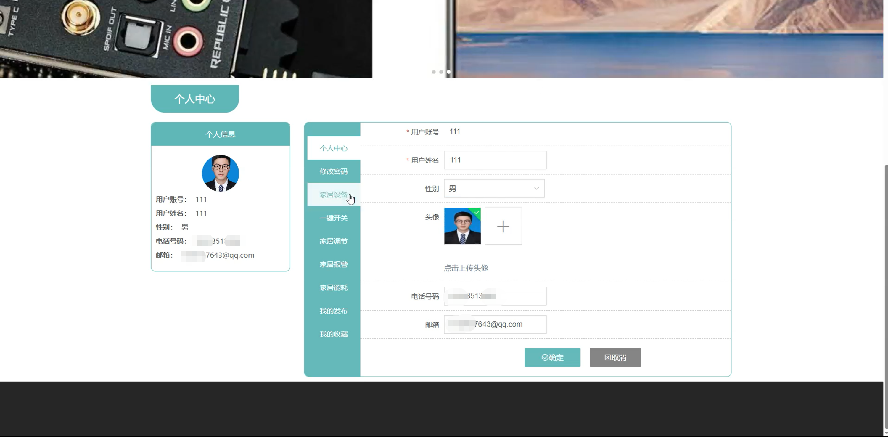
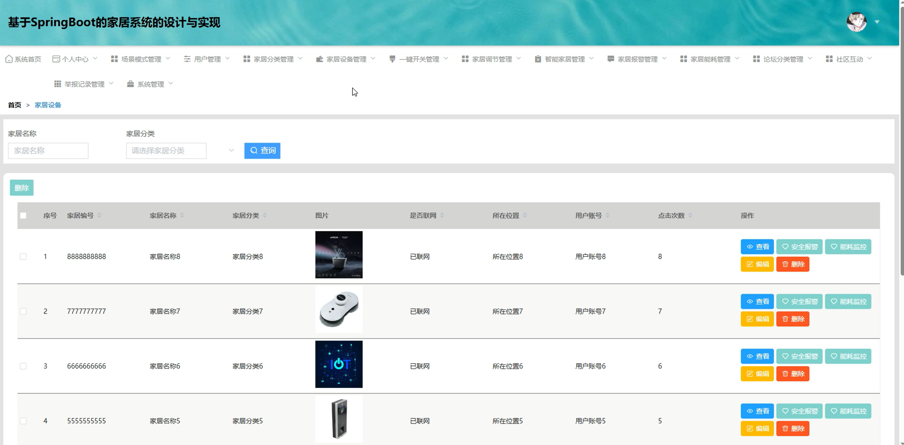
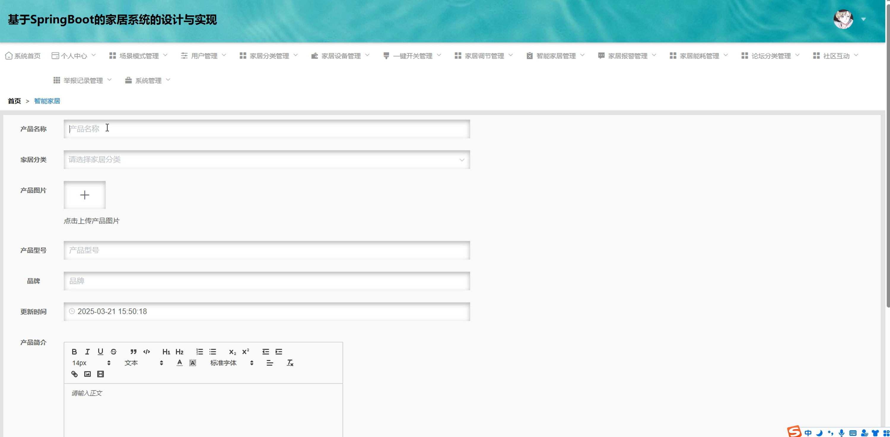
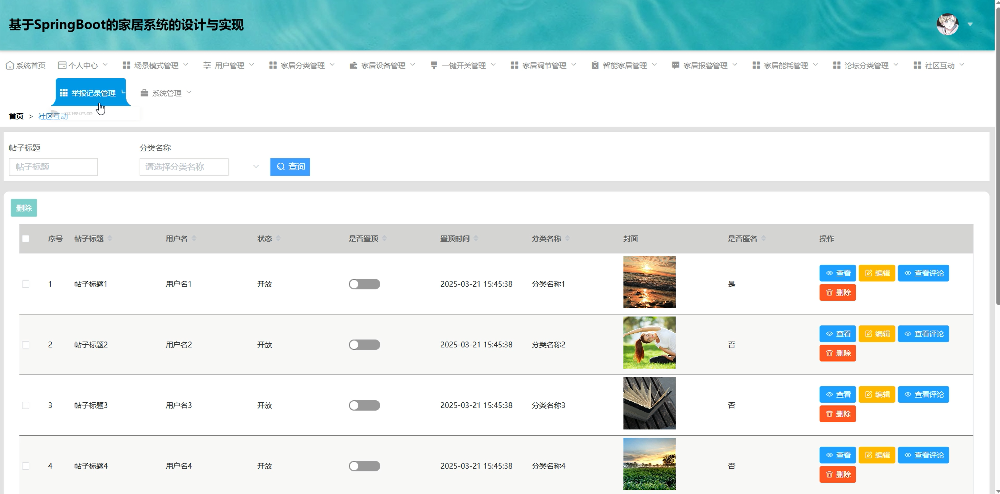
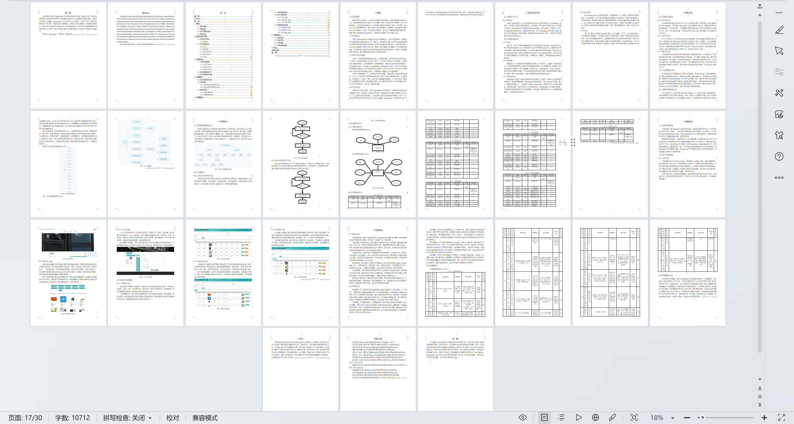

# springbootA430D
springbootA430D家居系统+LW
 
## 查看主页获取源码

### 一、关键词
家居设备管理、家居调节管理、智能家居管理

### 二、作品包含
源码+数据库+设计文档万字+全套环境和工具资源+本地部署教程

### 三、项目技术
前端技术：Html、Css、Js、Vue2.0、Element-ui
后端技术：Java、SpringBoot2.0、MyBatis

### 四、运行环境（以下版本亲测，其他版本未知，请自测）
开发工具：IDEA/eclipse  + VSCODE

数据库：MySQL5.7（最低要5.7版本）

数据库管理工具：Navicat10以上版本

环境配置软件： JDK1.8 + Maven3.6.3

前端Nodejs：14

浏览器：谷歌浏览器

### 五、项目介绍
项目编号：springbootA430D

家居系统可通过集中管理控制家居设备，实现家居使用的便捷化、安全化与节能化，提升居住舒适度与生活效率。

角色：管理员、用户

用户功能：系统首页、智能家居、社区互动、公告资讯、个人中心、修改密码、家居设备、一键开关、家居调节、家居报警、家居能耗、我的发布、我的收藏。

管理员功能：系统首页、个人中心、场景模式管理 、用户管理、家居分类管理、家居设备管理、一键开关管理、家居调节管理、智能家居管理、家居报警管理、家居能耗管理、论坛分类管理、社区互动、举报记录管理、系统管理。

### 六、运行截图

